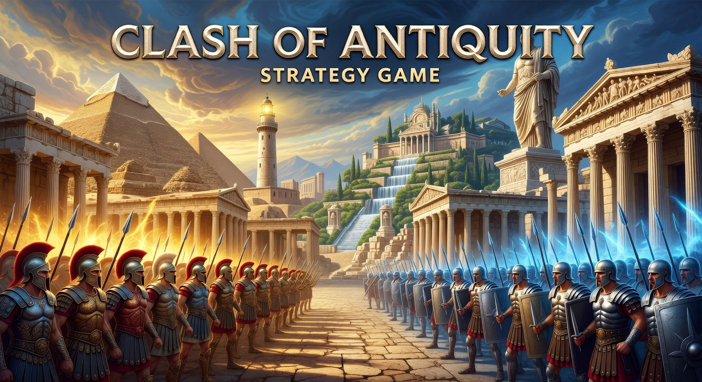

# 🎲 Gamy - Ludoteca Inteligente



**Gamy** es una aplicación web/móvil progresiva para la gestión de colecciones de juegos de mesa, registro avanzado de estadísticas, gamificación de partidas y análisis de rendimiento con logros automáticos.

> Desarrollada con React + Vite + TypeScript + Tailwind CSS + Zustand.

---

## 📦 Funcionalidades Principales

### 🏠 Ludoteca (Gestión de Juegos)
- **CRUD completo**: Añadir, editar y eliminar juegos de mesa
- **Imágenes locales**: Portadas almacenadas en `/public/images/` (sin enlaces rotos)
- **Categorización**: Etiquetas por tipo (Estrategia, Cartas, Filler, Cooperativo, Dados, Puzzle, etc.)
- **Dificultad ⭐**: Valoración de 1 a 5 estrellas
- **Duración ⏱**: Tiempo estimado en minutos con filtros por rangos
- **Sistema de expansiones**: Vincular expansiones a juegos base
- **Plantillas de puntuación**:
  - **Simple**: Un solo campo numérico total por jugador
  - **Compleja**: Múltiples categorías configurables con metadatos (Militar, Ciencia, Política, etc.)
  - **Categorías personalizadas**: El usuario puede añadir categorías escribiendo el nombre libremente
  - **Victorias especiales**: Configurables por juego (ej: Supremacía Militar, Científica, Política)

### 🎮 Registro de Partidas
- **Selección de juego** con buscador integrado
- **Selección de jugadores** con colores personalizados
- **Selector de expansiones dinámico**: Casillas de verificación para elegir expansiones activas
- **Sorteo de jugador inicial**: Botón interactivo con selección aleatoria
- **Victorias especiales**: Al marcar una victoria especial, se asigna el ganador sin necesidad de puntuar
- **Guardado automático** con redirección al historial

### 📋 Historial de Partidas
- **Lista completa** ordenada por fecha (más reciente primero)
- **Filtros** por juego y configuración de expansiones
- **Edición retrospectiva**: Corregir puntuaciones después de guardar
- **Eliminación** de partidas del registro
- **Detalle completo** con desglose de categorías por jugador

### 📊 Estadísticas y Ranking
- **Ranking Global**: Victorias, derrotas, tasa de victoria, total de partidas
- **Por juego específico**: Rendimiento detallado por título
- **Por tipo de juego**: Estadísticas filtradas por categoría
- **Filtro por expansión**: Consultar rendimiento según configuraciones específicas
- **Métricas avanzadas**: Puntos por partida, mejor racha, barras de progreso

### 🏆 Logros y Gamificación
Sistema automático de insignias que analiza los resultados al finalizar cada partida:

| Logro | Icono | Condición |
|-------|-------|-----------|
| 🔥 Racha de 3 | 🔥 | Ganar 3 partidas consecutivas |
| 💯 Club de los 100 | 💯 | Superar 100 puntos en una partida |
| 🕊️ El Pacificador | 🕊️ | Ganar 7 Wonders con 0 en categoría militar |

### 👥 Gestión de Jugadores
- Añadir/editar/eliminar jugadores
- Selección de color personalizado
- Estadísticas individuales (partidas, victorias, tasa, logros)

---

## 🚀 Tecnologías

| Tecnología | Versión |
|-----------|---------|
| React | 19.x |
| Vite | 7.x |
| TypeScript | 5.x |
| Tailwind CSS | 4.x |
| Zustand | 5.x |
| uuid | 14.x |

---

## 🛠️ Instalación

```bash
# Clonar el repositorio
git clone <tu-repo>
cd gamy

# Instalar dependencias
npm install

# Iniciar en modo desarrollo
npm run dev

# Construir para producción
npm run build
```

---

## 🗄️ Configuración de Turso (Base de Datos Remota)

Gamy está preparado para sincronizar datos con **Turso** (base de datos SQLite distribuida). Actualmente los datos se almacenan localmente con persistencia en `localStorage`. Para habilitar la sincronización remota:

### 1. Instalar el CLI de Turso

```bash
# macOS / Linux
curl -sSfL https://get.tur.so/install.sh | bash

# Windows (PowerShell)
iwr -useb https://get.tur.so/install.ps1 | iex
```

### 2. Autenticarse

```bash
turso auth signup    # Primera vez (crear cuenta gratuita)
# o
turso auth login     # Ya tienes cuenta
```

### 3. Crear una base de datos

```bash
turso db create gamy-db
```

### 4. Obtener la URL de conexión

```bash
turso db show gamy-db --url
# Ejemplo: libsql://gamy-db-tu-usuario.turso.io
```

### 5. Crear un token de autenticación

```bash
turso db tokens create gamy-db
# Copia el token generado
```

### 6. Configurar variables de entorno

Crea un archivo `.env` en la raíz del proyecto:

```env
VITE_TURSO_DB_URL=libsql://gamy-db-tu-usuario.turso.io
VITE_TURSO_DB_AUTH_TOKEN=tu-token-aqui
```

### 7. Esquema SQL de la base de datos

Ejecuta este SQL en Turso para crear las tablas:

```sql
-- Juegos
CREATE TABLE games (
  id TEXT PRIMARY KEY,
  name TEXT NOT NULL,
  image_url TEXT,
  types TEXT,               -- JSON array: ["Estrategia","Cartas"]
  is_expansion BOOLEAN DEFAULT FALSE,
  base_game_id TEXT REFERENCES games(id),
  scoring_template TEXT,    -- JSON: {type:"complex", categories:[...]}
  allow_special_victory BOOLEAN DEFAULT FALSE,
  special_victory_types TEXT, -- JSON array
  difficulty INTEGER,       -- 1-5
  duration INTEGER,         -- minutos
  created_at TEXT DEFAULT (datetime('now'))
);

-- Jugadores
CREATE TABLE players (
  id TEXT PRIMARY KEY,
  name TEXT NOT NULL,
  color TEXT NOT NULL,
  avatar TEXT,
  created_at TEXT DEFAULT (datetime('now'))
);

-- Partidas
CREATE TABLE matches (
  id TEXT PRIMARY KEY,
  game_id TEXT REFERENCES games(id),
  date TEXT NOT NULL,
  player_ids TEXT,             -- JSON array
  active_expansion_ids TEXT,   -- JSON array
  player_scores TEXT,          -- JSON array de PlayerScore
  winner_id TEXT REFERENCES players(id),
  first_player_id TEXT REFERENCES players(id),
  synced BOOLEAN DEFAULT FALSE,
  created_at TEXT DEFAULT (datetime('now'))
);

-- Logros de jugadores
CREATE TABLE player_achievements (
  achievement_id TEXT NOT NULL,
  player_id TEXT REFERENCES players(id),
  unlocked_at TEXT NOT NULL,
  match_id TEXT REFERENCES matches(id),
  PRIMARY KEY (achievement_id, player_id)
);
```

### 8. Para producción (recomendado)

No expongas las credenciales de Turso directamente en el frontend. Usa un backend intermediario:

- **Cloudflare Workers** con `@libsql/client`
- **Vercel Edge Functions**
- **Servidor Express/Fastify** con `@libsql/client`

### 9. Estado de conexión

La aplicación muestra un indicador visual del estado de la base de datos:

| Color | Estado | Significado |
|-------|--------|-------------|
| 🟢 Verde | `connected` | Conectado a Turso |
| 🟠 Naranja | `reconnecting` | Reconectando... |
| ⚫ Gris | `disconnected` | Sin conexión (funciona en local) |

Las partidas se almacenan **localmente** hasta que se establezca la conexión con Turso, momento en el que se sincronizan automáticamente.

---

## 📱 Características de UX

- **Sin zoom**: Viewport configurado con `maximum-scale=1.0, user-scalable=no`
- **Responsive**: Adaptado a cualquier ancho de dispositivo
- **Safe area**: Respeto del área segura en dispositivos con notch
- **Scroll controlado**: Sin rebotes ni desbordamientos no deseados
- **Modales desde abajo**: Interacción táctil optimizada (slide-up desde el borde inferior)
- **Animaciones**: Transiciones suaves en hover, filtros y cambios de estado

---

## 🗂️ Estructura del Proyecto

```
src/
├── App.tsx                    # Componente principal con navegación
├── main.tsx                   # Punto de entrada
├── index.css                  # Estilos globales Tailwind
├── types.ts                   # Interfaces TypeScript
├── data/
│   └── defaultGames.ts        # Ludoteca inicial (24 juegos)
├── store/
│   └── useStore.ts            # Estado global (Zustand + persist)
├── db/
│   └── turso.ts               # Configuración de Turso
├── utils/
│   └── cn.ts                  # Utilidad clsx + tailwind-merge
└── components/
    ├── DbIndicator.tsx         # Indicador de estado de BD
    ├── Library.tsx             # Ludoteca con CRUD y filtros
    ├── PlaySession.tsx         # Flujo completo de partida
    ├── History.tsx             # Historial con edición
    ├── Stats.tsx               # Estadísticas y ranking
    └── Players.tsx             # Gestión de jugadores
public/
└── images/                     # Imágenes locales de juegos
```

---

## 🎲 Ludoteca Inicial (24 juegos)

| # | Juego | Tipo | ⭐ | ⏱ |
|---|-------|------|----|----|
| 1 | Pokémon Puzzle (1000 piezas) | Puzzle | 2 | 120' |
| 2 | Salton Sea | Filler | 1 | 15' |
| 3 | Hanabi | Cooperativo | 3 | 30' |
| 4 | Dice Forge | Dados | 3 | 45' |
| 5 | Bizarre Bid | Cartas | 2 | 30' |
| 6 | Zombie Kittens | Cartas | 2 | 15' |
| 7 | Jaipur | Cartas | 2 | 30' |
| 8 | La Isla Prohibida | Cooperativo | 3 | 45' |
| 9 | Codex: Silorealis | Estrategia | 4 | 90' |
| 10 | Sushi Go! | Cartas | 1 | 15' |
| 11 | Sushi Go Party! | Cartas | 2 | 30' |
| 12 | Megacity: Oceania | Construcción | 3 | 60' |
| 13 | Flamecraft | Estrategia | 3 | 60' |
| 14 | Dinosaur World | Estrategia | 4 | 90' |
| 15 | Marrakech | Estrategia | 2 | 30' |
| 16 | CATAN: El Duelo | Duel | 3 | 45' |
| 17 | Bamboo | Filler | 1 | 15' |
| 18 | Jenga | Destreza | 1 | 15' |
| 19 | Carcassonne | Estrategia | 3 | 45' |
| 20 | Saboteur | Cartas | 2 | 30' |
| 21 | Small World | Estrategia | 3 | 60' |
| 22 | 7 Wonders | Estrategia | 3 | 45' |
| 23 | 7 Wonders Duel | Duel | 3 | 30' |
| 24 | 7 Wonders Duel: Pantheon | Expansión | — | — |
| 25 | 7 Wonders Duel: Agora | Expansión | — | — |

---

## 🤝 Contribución

Las contribuciones son bienvenidas. Por favor:

1. Haz fork del proyecto
2. Crea una rama (`git checkout -b feature/nueva-funcionalidad`)
3. Haz commit de tus cambios (`git commit -m 'Añade nueva funcionalidad'`)
4. Haz push a la rama (`git push origin feature/nueva-funcionalidad`)
5. Abre un Pull Request

---

## 📄 Licencia

MIT © 2024 — Hecho con ❤️ para la comunidad de juegos de mesa
